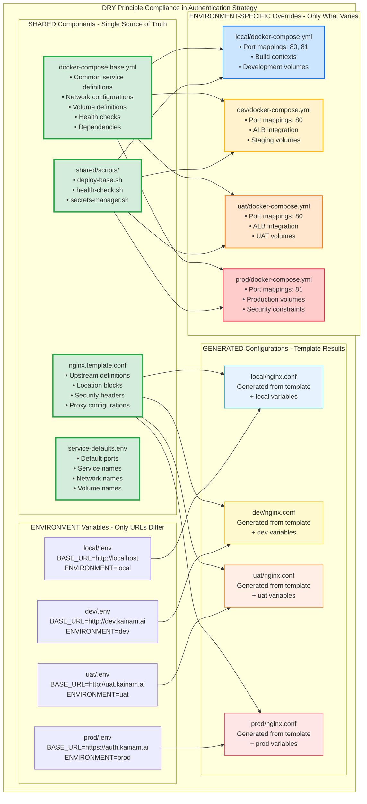

# [AUTHENTICATION ENVIRONMENT STRATEGY]

**Date:** 2025-08-30  
**Owner:** DevOps Team  
**Status:** Research Complete - Implementation Pending

## 1. Chosen Strategy
This project should adopt a **Hybrid Environment-First Strategy** combining directory-based environment separation with Docker Compose inheritance patterns and templated configurations to achieve maximum isolation, consistency, and maintainability for the Authentication module.

> *The strategy addresses the critical configuration chaos identified in Sprint 2 (ISSUE-007, ISSUE-008, ISSUE-009) by implementing a structured approach that separates environment-specific configurations while maintaining shared base configurations through inheritance and templating.*

## 2. Justification
The Authentication module's current configuration chaos requires a comprehensive solution that balances environment isolation with code reusability. The hybrid approach was chosen over pure templating or monolithic configurations because:

> *The Authentication module has complex multi-service dependencies (Keycloak, OAuth2-proxy, NGINX, Backend, Frontend, PostgreSQL) with intricate networking requirements and security configurations that vary significantly between environments. A pure templating approach would be too rigid, while a monolithic approach would perpetuate the configuration drift issues that caused Sprint 2 failures. The hybrid strategy provides the flexibility needed for complex authentication flows while maintaining strict environment isolation.*

## 3. Implementation Details

### Current Problematic State Analysis:
**Configuration Chaos Evidence:**
- `local.env` vs `ec2.env` vs `.env` files with different structures
- `docker-compose-local.yml` vs `docker-compose.yml` with different port strategies (8000 vs 8001)
- `nginx-local.conf` vs `nginx.conf` with different upstream configurations (3000 vs 3001)
- Scripts hardcoded for specific environments (`start_keystone.sh` assumes production)
- Environment variables scattered across multiple files with inconsistent naming

### Target Directory Structure:
```
authentication/
├── config/
│   ├── environments/
│   │   ├── local/
│   │   │   ├── docker-compose.yml          # Local-specific overrides
│   │   │   ├── nginx.conf                  # Local NGINX config
│   │   │   ├── .env                        # Local environment variables
│   │   ├── dev/
│   │   │   ├── docker-compose.yml          # Dev-specific overrides
│   │   │   ├── .env                        # Dev environment variables
│   │   │   └── deploy_keycloak.sh          # Dev deployment script
│   │   └── uat/
│   │       ├── docker-compose.yml          # UAT-specific overrides
│   │       ├── .env                        # UAT environment variables
│   │       └── deploy_keycloak.sh          # UAT deployment script
│   │   └── prod/
│   │       ├── docker-compose.yml          # Production-specific overrides
│   │       ├── .env                        # Production environment variables
│   │       └── deploy_keycloak.sh          # Production deployment script
│   ├── shared/
│   │   ├── docker-compose.base.yml         # Base service definitions
│   │   ├── service-defaults.env            # Default service configuration
│   │   └── scripts/
│   └── templates/
│       └── docker-compose.template.yml     # Docker Compose template
├── scripts/                                # Legacy scripts (to be deprecated)
```

### Environment Variable Management:
**Standardized Variable Structure:**
```bash
# Infrastructure Variables (environment-specific)
ENVIRONMENT=local                           # Environment identifier
BASE_URL=http://localhost                   # Base URL for all services
EXTERNAL_PORT=80                           # External port for NGINX
AWS_REGION=us-east-2                       # AWS region (production only)

# Service URLs (derived from BASE_URL)
OAUTH2_PROXY_OIDC_ISSUER_URL=${BASE_URL}/realms/keystone-mvp
OAUTH2_PROXY_REDIRECT_URL=${BASE_URL}/oauth2/callback
NEXT_PUBLIC_OAUTH2_PROXY_URL=${BASE_URL}/oauth2/start

# Internal Service Configuration (identical across environments)
POSTGRES_DB=keycloak
KEYCLOAK_REALM=keystone-mvp
OAUTH2_PROXY_CLIENT_ID=keystone-frontend

# Service Ports (standardized across environments)
BACKEND_INTERNAL_PORT=8000
FRONTEND_INTERNAL_PORT=3000
OAUTH2_PROXY_INTERNAL_PORT=4180
KEYCLOAK_INTERNAL_PORT=8080
```

### Docker Compose Inheritance Pattern:
```yaml
# config/shared/docker-compose.base.yml
version: '3.8'
services:
  db:
    image: postgres:16.4
    container_name: keystone-db
    networks:
      - keystone-net
    environment:
      POSTGRES_USER: ${POSTGRES_USER}
      POSTGRES_PASSWORD: ${POSTGRES_PASSWORD}
      POSTGRES_DB: ${POSTGRES_DB}
    volumes:
      - postgres_data:/var/lib/postgresql/data
    healthcheck:
      test: ["CMD-SHELL", "pg_isready -U ${POSTGRES_USER}"]
      interval: 30s
      timeout: 10s
      retries: 3

  keycloak:
    image: quay.io/keycloak/keycloak:26.3.2
    container_name: keystone-keycloak
    networks:
      - keystone-net
    environment:
      KEYCLOAK_ADMIN: ${KEYCLOAK_ADMIN}
      KEYCLOAK_ADMIN_PASSWORD: ${KEYCLOAK_ADMIN_PASSWORD}
      KC_DB: postgres
      KC_DB_URL: jdbc:postgresql://db:5432/${POSTGRES_DB}
      KC_DB_USERNAME: ${POSTGRES_USER}
      KC_DB_PASSWORD: ${POSTGRES_PASSWORD}
      KC_HOSTNAME_STRICT: false
      KC_HOSTNAME_STRICT_HTTPS: false
      KC_HTTP_ENABLED: true
      KC_HTTPS_ENABLED: false
      KC_HEALTH_ENABLED: true
    command: start-dev
    depends_on:
      db:
        condition: service_healthy

networks:
  keystone-net:
    driver: bridge

volumes:
  postgres_data:
```

```yaml
# config/environments/local/docker-compose.yml
version: '3.8'
services:
  keycloak:
    ports:
      - "${KEYCLOAK_PORT:-81}:8080"

  backend:
    build:
      context: ../../../tests/walking_skeleton/test_api
      dockerfile: Dockerfile
    container_name: keystone-backend
    networks:
      - keystone-net
    ports:
      - "8000:8000"  # Local development port
    environment:
      - PYTHONPATH=/app
    working_dir: /app
    command: python main.py
    depends_on:
      - keycloak

  nginx:
    image: nginx:1.21-alpine
    container_name: keystone-nginx
    networks:
      - keystone-net
    ports:
      - "${NGINX_PORT:-80}:80"
    volumes:
      - ./nginx.conf:/etc/nginx/nginx.conf:ro
    depends_on:
      - backend
      - frontend
      - oauth2-proxy
      - keycloak
    healthcheck:
      test: ["CMD", "wget", "--no-verbose", "--tries=1", "--spider", "http://127.0.0.1/health"]
      interval: 30s
      timeout: 10s
      retries: 3
```

## 4. Trade-offs
This approach introduces additional complexity in the initial setup and requires more sophisticated deployment scripts, but provides superior environment isolation and prevents the configuration drift issues that plagued Sprint 2.

> *The hybrid strategy requires more upfront investment in tooling and scripts compared to simpler approaches, but eliminates the risk of cross-environment configuration contamination that caused ISSUE-007 (OAuth2 configuration mismatch), ISSUE-008 (port inconsistency), and ISSUE-009 (URL format differences). The complexity is justified by the critical nature of authentication services and the need for production-grade reliability.*

## 5. Environment Configurations

### Local Development
```yaml
Purpose: Development and testing with hot-reload capabilities
Base URL: http://localhost
External Ports: NGINX:80, Keycloak:81
Internal Ports: Backend:8000, Frontend:3000, OAuth2-proxy:4180
Security: Open access, hardcoded credentials for convenience
Secrets: Local environment variables (no AWS integration)
NGINX Config: Development-optimized with websocket support
Status: ✅ Current implementation working
```

### Development
```yaml
Purpose: Development and testing with hot-reload capabilities
Base URL: http://dev.kainam.ai
External Ports: NGINX:80 (behind ALB)
Internal Ports: Backend:8000, Frontend:3000, OAuth2-proxy:4180
Security: Restricted access, office/VPN IP ranges
Secrets: AWS Secrets Manager integration
NGINX Config: Production-like with staging-specific logging
Status: ❌ Configuration pending
```

### UAT
```yaml
Purpose: Pre-production testing with production-like configuration
Base URL: http://uat.kainam.ai
External Ports: NGINX:80 (behind ALB)
Internal Ports: Backend:8000, Frontend:3000, OAuth2-proxy:4180
Security: Restricted access, office/VPN IP ranges
Secrets: AWS Secrets Manager integration
NGINX Config: Production-like with uat-specific logging
Status: ❌ Configuration pending
```

### Production
```yaml
Purpose: Live production workloads with maximum security
Base URL: https://auth.kainam.ai
External Ports: NGINX:81 (EC2 direct access)
Internal Ports: Backend:8000, Frontend:3000, OAuth2-proxy:4180
Security: Highly restricted, bastion/admin access only
Secrets: AWS Secrets Manager with IAM role-based access
NGINX Config: Production-optimized with security headers
Status: ❌ Configuration pending
```

## 6. Service Standardization Requirements

### Identical Across Environments:
- **Service Names**: `keystone-db`, `keystone-keycloak`, `keystone-backend`, `keystone-frontend`, `keystone-oauth2-proxy`, `keystone-nginx`
- **Container Names**: Match service names exactly
- **Internal Ports**: Backend=8000, Frontend=3000, OAuth2-proxy=4180, Keycloak=8080, PostgreSQL=5432
- **Network Names**: `keystone-net` in all environments
- **Volume Names**: `postgres_data`, `nginx_logs`, `keycloak_data`

### Environment-Specific Variables:
- **BASE_URL**: Environment-specific base URL for all external access
- **External Port Mappings**: Different external ports per environment
- **Security Configurations**: Different trusted IP ranges and access policies
- **Secrets Sources**: Local env vars vs AWS Secrets Manager

## 7. NGINX Configuration Management

### Template-Based Approach:
```nginx
# config/templates/nginx.template.conf
upstream backend_service {
    server keystone-backend:${BACKEND_INTERNAL_PORT};
    keepalive 32;
}

upstream frontend_service {
    server keystone-frontend:${FRONTEND_INTERNAL_PORT};
    keepalive 32;
}

upstream auth_proxy_service {
    server keystone-oauth2-proxy:${OAUTH2_PROXY_INTERNAL_PORT};
    keepalive 32;
}

server {
    listen 80;
    server_name ${SERVER_NAME};
    
    # Environment-specific security headers
    ${SECURITY_HEADERS}
    
    # API routes with authentication
    location /api/ {
        auth_request /oauth2/auth;
        auth_request_set $user $upstream_http_x_auth_request_user;
        auth_request_set $email $upstream_http_x_auth_request_email;
        
        proxy_pass http://backend_service;
        proxy_set_header X-User-Email $email;
        proxy_set_header X-User-Name $user;
    }
    
    # OAuth2 proxy routes
    location /oauth2/ {
        proxy_pass http://auth_proxy_service;
        ${OAUTH2_PROXY_BUFFER_CONFIG}
    }
    
    # Frontend routes
    location / {
        proxy_pass http://frontend_service;
        ${FRONTEND_PROXY_CONFIG}
    }
}
```

### Environment-Specific Generation:
```bash
# config/environments/local/deploy.sh
#!/bin/bash
export BACKEND_INTERNAL_PORT=8000
export FRONTEND_INTERNAL_PORT=3000
export OAUTH2_PROXY_INTERNAL_PORT=4180
export SERVER_NAME=localhost
export SECURITY_HEADERS=""
export OAUTH2_PROXY_BUFFER_CONFIG=""
export FRONTEND_PROXY_CONFIG="proxy_http_version 1.1; proxy_set_header Upgrade \$http_upgrade;"

envsubst < ../../templates/nginx.template.conf > nginx.conf
```

## 8. Deployment Strategy

### Environment-Aware Deployment Script:
```bash
#!/bin/bash
# config/shared/scripts/deploy-base.sh

set -euo pipefail

ENVIRONMENT=${1:-local}
SCRIPT_DIR="$(cd "$(dirname "${BASH_SOURCE[0]}")" && pwd)"
CONFIG_DIR="$(dirname "$(dirname "${SCRIPT_DIR}")")"
ENV_DIR="${CONFIG_DIR}/environments/${ENVIRONMENT}"

log() {
    echo "[DEPLOY-${ENVIRONMENT^^}] $(date '+%Y-%m-%d %H:%M:%S') - $1"
}

deploy_environment() {
    log "Starting deployment for environment: ${ENVIRONMENT}"
    
    # Validate environment directory exists
    if [[ ! -d "${ENV_DIR}" ]]; then
        log "ERROR: Environment directory not found: ${ENV_DIR}"
        exit 1
    fi
    
    # Change to environment directory
    cd "${ENV_DIR}"
    
    # Load environment variables
    if [[ -f ".env" ]]; then
        log "Loading environment variables from .env"
        set -a
        source .env
        set +a
    fi
    
    # Generate configurations from templates
    log "Generating configurations from templates..."
    if [[ -f "generate-configs.sh" ]]; then
        ./generate-configs.sh
    fi
    
    # Handle secrets based on environment
    case "${ENVIRONMENT}" in
        local)
            log "Using local environment variables for secrets"
            ;;
        staging|production)
            log "Fetching secrets from AWS Secrets Manager"
            source "${CONFIG_DIR}/shared/scripts/secrets-manager.sh"
            ;;
    esac
    
    # Deploy with Docker Compose inheritance
    log "Deploying services with Docker Compose..."
    docker-compose \
        -f "${CONFIG_DIR}/shared/docker-compose.base.yml" \
        -f "docker-compose.yml" \
        up -d
    
    # Run health checks
    log "Running health checks..."
    "${CONFIG_DIR}/shared/scripts/health-check.sh" "${ENVIRONMENT}"
    
    log "Deployment completed successfully for environment: ${ENVIRONMENT}"
}

deploy_environment "$@"
```

### Usage Examples:
```bash
# Deploy to local environment
./config/shared/scripts/deploy-base.sh local

# Deploy to staging environment
./config/shared/scripts/deploy-base.sh staging

# Deploy to production environment
./config/shared/scripts/deploy-base.sh production
```

## 9. Migration Strategy

### Phase 1: Directory Structure Setup (Priority: CRITICAL)
1. **Create Environment Directory Structure**
2. **Migrate Existing Files**:
   - `docker-compose-local.yml` → `config/environments/local/docker-compose.yml`
   - `docker-compose.yml` → `config/environments/production/docker-compose.yml`
   - `nginx-local.conf` → `config/environments/local/nginx.conf`
   - `nginx.conf` → `config/environments/production/nginx.conf`
   - `local.env` → `config/environments/local/.env`
3. **Create Shared Base Files**:
   - Extract common service definitions to `config/shared/docker-compose.base.yml`
   - Create NGINX template in `config/templates/nginx.template.conf`

### Phase 2: Service Standardization (Priority: CRITICAL)
1. **Standardize Internal Ports**: Ensure all environments use identical internal ports
2. **Unify Service Names**: Consistent `keystone-{service}` naming across all environments
3. **Standardize Container Names**: Match service names exactly

### Phase 3: Script Migration (Priority: HIGH)
1. **Create Environment-Aware Scripts**: Replace hardcoded scripts with environment-aware versions
2. **Implement Template Generation**: Add configuration generation from templates
3. **Migrate Existing Scripts**: Update `start_keystone.sh`, `fetch_secrets.sh` to use new structure

### Phase 4: Testing Integration (Priority: HIGH)
1. **Environment-Specific Tests**: Create test suites for each environment
2. **Update Gateway Tests**: Modify `gateway_test.sh` to work with new structure
3. **Validation Scripts**: Create configuration validation utilities

## 10. Benefits and Operational Advantages

### Strategic Benefits:
1. **Environment Isolation**: Complete separation prevents cross-environment configuration contamination
2. **Configuration Consistency**: Shared base configurations ensure consistent service definitions
3. **Template-Based Flexibility**: NGINX and Docker Compose templates allow environment-specific customization
4. **Script Standardization**: Environment-aware deployment scripts reduce human error
5. **Scalable Architecture**: Easy to add new environments (UAT, pre-prod, etc.)

### Operational Benefits:
- **Reduced Configuration Drift**: Template-based approach prevents the port/URL mismatches that caused Sprint 2 issues
- **Simplified Debugging**: Clear environment separation makes troubleshooting more straightforward
- **Enhanced Security**: Environment-specific security configurations and secrets management
- **Improved Testing**: Environment-specific test suites validate configurations independently
- **Faster Onboarding**: Clear directory structure and documentation accelerate team member onboarding

## 11. Security Considerations

### Secrets Management:
- **Local**: Environment variables in `.env` files (excluded from version control)
- **Staging/Production**: AWS Secrets Manager with IAM role-based access
- **Script Integration**: Automatic secrets fetching in deployment scripts

### Network Security:
- **Environment-Specific Firewall Rules**: Different trusted IP ranges per environment
- **Service Isolation**: OAuth2-proxy internal-only access in all environments
- **NGINX Security Headers**: Environment-appropriate security header configurations

### Access Control:
- **Environment-Specific Permissions**: Different IAM roles and policies per environment
- **Deployment Restrictions**: Environment-specific deployment permissions
- **Audit Logging**: Environment-tagged audit trails for compliance

## 12. Current Implementation Status

### Completed:
- ✅ **Local Environment**: Fully functional with NGINX gateway integration
- ✅ **Production Environment**: Partially implemented with AWS Secrets Manager
- ✅ **Issue Resolution**: Sprint 2 configuration issues documented and resolved

### Pending:
- ❌ **Directory Structure Migration**: New structure not yet implemented
- ❌ **Staging Environment**: Configuration not created
- ❌ **Script Standardization**: Environment-aware scripts not implemented
- ❌ **Template System**: NGINX and Docker Compose templates not created

### Next Steps:
1. **Implement Directory Structure**: Create new config directory structure
2. **Migrate Existing Configurations**: Move current files to new structure
3. **Create Staging Environment**: Implement staging configuration
4. **Develop Template System**: Create NGINX and Docker Compose templates
5. **Update Deployment Scripts**: Create environment-aware deployment automation

## 13. Related Documentation
- [Technical Debt Report](./TECHNICAL_DEBT.md) - Configuration management debt items
- [Sprint 2 Issues](./issues/) - Specific configuration problems resolved
- [Backend Log](./agent_logs/backend_log.md) - Implementation history and decisions
- [Testing Documentation](./testing/) - Environment-specific testing procedures

## 14. Diagrams



---

*This strategy provides a comprehensive solution to the Authentication module's configuration management challenges, addressing the root causes of Sprint 2 issues while establishing a scalable foundation for multi-environment operations.*
