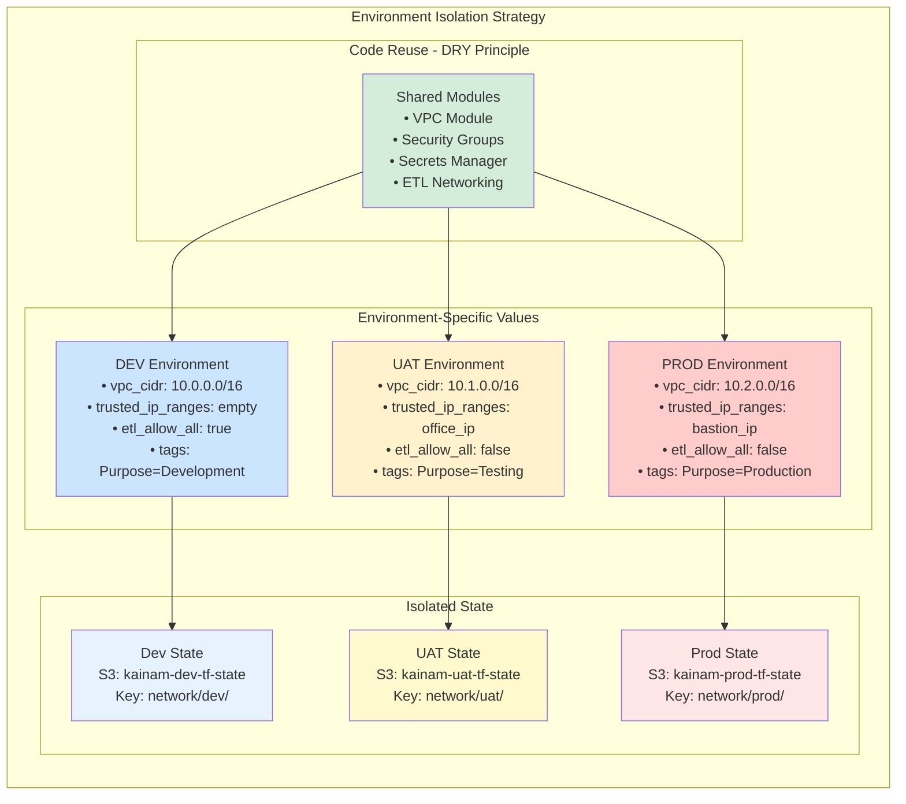

# [ENVIRONMENT STRATEGY]

**Date:** 2025-08-30
**Owner:** DevOps Team  
**Status:** Active Implementation

## 1. Chosen Strategy
This project uses a **modular, environment-isolated Terraform approach** with separate directories for each environment combined with reusable modules to ensure maximum isolation, consistency, and code reusability.

> *The strategy follows the DRY (Don't Repeat Yourself) principle while maintaining complete environment isolation through reusable modules, environment-specific configurations, isolated state management, and consistent resource naming patterns.*

## 2. Justification
The modular approach with environment-specific directories was chosen over Terraform Workspaces and monolithic configurations to prevent accidental application of dev variables to production and to allow for structural differences between environments while maintaining code reusability.

> *This approach addresses the configuration chaos identified in Sprint 2 (ISSUE-007, ISSUE-008, ISSUE-009) by providing clear separation between environments while avoiding code duplication through shared modules. It enables parallel development, prevents cross-environment issues, and supports different security policies per environment (e.g., open access in dev, restricted access in UAT, highly restricted in prod).*

## 3. Implementation Details

### Directory Structure:
```
infra-terraform/terraform/
├── envs/                          # Environment-specific configurations
│   ├── dev/main.tf               # Development environment
│   ├── uat/main.tf               # User Acceptance Testing environment  
│   └── prod/main.tf              # Production environment
├── modules/                       # Reusable infrastructure modules
│   ├── vpc/                      # VPC, subnets, gateways, routing
│   ├── security-groups/          # ALB, Web, DB security groups
│   ├── secrets-manager/          # AWS Secrets Manager + IAM
│   └── kimball-etl-networking/   # ETL-specific networking
├── main.tf                       # Legacy root config (deprecated)
├── variables.tf                  # Default variable definitions
└── versions.tf                   # Provider requirements
```

### State Management:
Each environment maintains completely separate Terraform state files with isolated S3 backends:

> *DEV: `kainam-dev-tf-state/network/dev/terraform.tfstate`*  
> *UAT: `kainam-uat-tf-state/network/uat/terraform.tfstate`*  
> *PROD: `kainam-prod-tf-state/network/prod/terraform.tfstate`*

### Variable Management:
Environment-specific variables are handled through local values blocks in each environment's main.tf file. Shared secrets are provided via a common `secrets.tfvars` file.

> *Each environment directory contains its own locals block with environment-specific values (CIDR blocks, security policies, tags). No default values are set in module variables.tf files - all values must be explicitly provided by the calling environment.*

## 4. Trade-offs
This approach leads to some configuration duplication between environment directories (each environment has its own main.tf file), but this is an acceptable trade-off for the safety, isolation, and clarity it provides.

> *While each environment requires its own configuration file, the actual infrastructure logic is centralized in reusable modules, minimizing true code duplication. The slight configuration overhead is offset by the prevention of cross-environment issues, clear separation of concerns, and the ability to have environment-specific structural differences.*

## 5. Environment Configurations

### Development (DEV)
```yaml
Purpose: Development and testing
VPC CIDR: 10.0.0.0/16
Security: Open (no IP restrictions)
ETL Access: Allow all external access
State: kainam-dev-tf-state/network/dev/
Tags: Purpose=Development
Status: ✅ Fully implemented and deployed
```

### User Acceptance Testing (UAT)
```yaml
Purpose: Pre-production testing
VPC CIDR: 10.1.0.0/16
Security: Restricted (office/VPN IPs only)
ETL Access: Controlled external access
State: kainam-uat-tf-state/network/uat/
Tags: Purpose=User Acceptance Testing
Status: ❌ Configuration pending
```

### Production (PROD)
```yaml
Purpose: Live production workloads
VPC CIDR: 10.2.0.0/16
Security: Highly restricted (bastion/admin IPs only)
ETL Access: No external access
State: kainam-prod-tf-state/network/prod/
Tags: Purpose=Production
Status: ❌ Configuration pending
```

## 6. Code Reusability Implementation

### Modular Architecture Pattern
```hcl
# Each environment calls the same modules with different parameters
module "vpc" {
  source = "../../modules/vpc"
  
  environment          = local.environment      # "dev", "uat", "prod"
  project_name         = local.project_name     # "kainam"
  vpc_cidr             = local.vpc_cidr         # Environment-specific CIDR
  availability_zones   = local.availability_zones
  public_subnet_cidrs  = local.public_subnet_cidrs
  private_subnet_cidrs = local.private_subnet_cidrs
  common_tags          = local.common_tags
}
```

### Local Values Pattern
```hcl
# Environment-specific values defined in locals block
locals {
  aws_region   = "us-east-2"
  environment  = "uat"                    # Environment identifier
  project_name = "kainam"
  
  # UAT-specific networking
  vpc_cidr             = "10.1.0.0/16"   # Different from dev (10.0.0.0/16)
  public_subnet_cidrs  = ["10.1.1.0/24", "10.1.2.0/24"]
  private_subnet_cidrs = ["10.1.101.0/24", "10.1.102.0/24"]
  
  # UAT-specific security
  trusted_ip_ranges = ["203.0.113.0/24"] # Office IP range
  etl_allow_all_external_access = false  # More secure than dev
  
  common_tags = {
    Project     = local.project_name
    Environment = local.environment
    Purpose     = "User Acceptance Testing"
  }
}
```

### Consistent Module Interface
All modules accept the same core parameters:
- `environment` - Environment identifier
- `project_name` - Project name for resource naming
- `common_tags` - Consistent tagging across resources

## 7. UAT Environment Example

### Resource Naming Pattern
```
VPC:              kainam-uat-vpc
Public Subnets:   kainam-uat-public-subnet-a, kainam-uat-public-subnet-b
Private Subnets:  kainam-uat-private-subnet-a, kainam-uat-private-subnet-b
Security Groups:  kainam-uat-alb-sg, kainam-uat-web-sg, kainam-uat-db-sg
ETL Subnets:      kainam-uat-kimball-etl-public-subnet-a
```

### Network Configuration
```
VPC CIDR:           10.1.0.0/16
Public Subnets:     10.1.1.0/24, 10.1.2.0/24
Private Subnets:    10.1.101.0/24, 10.1.102.0/24
ETL Public:         10.1.3.0/24
ETL Private:        10.1.103.0/24
Availability Zones: us-east-2a, us-east-2b
```

### Security Configuration
```hcl
# More restrictive than dev, less than prod
trusted_ip_ranges = [
  "203.0.113.0/24",  # Office IP range
  "198.51.100.0/24"  # VPN IP range
]
etl_allow_all_external_access = false  # Controlled access
```

## 8. Deployment Procedures

### Deploy UAT Environment
```bash
# Navigate to UAT environment
cd infra-terraform/terraform/envs/uat/

# Initialize Terraform (creates UAT state bucket)
terraform init

# Plan deployment
terraform plan -var-file="../../secrets.tfvars"

# Apply infrastructure
terraform apply -var-file="../../secrets.tfvars"
```

### Deploy All Environments
```bash
# Deploy Dev
cd envs/dev && terraform apply -var-file="../../secrets.tfvars"

# Deploy UAT  
cd ../uat && terraform apply -var-file="../../secrets.tfvars"

# Deploy Prod
cd ../prod && terraform apply -var-file="../../secrets.tfvars"
```

## 9. State Management Strategy

### Isolated State Files
Each environment maintains completely separate Terraform state:

```hcl
# DEV Environment
backend "s3" {
  bucket = "kainam-dev-tf-state"
  key    = "network/dev/terraform.tfstate"
  region = "us-east-2"
}

# UAT Environment  
backend "s3" {
  bucket = "kainam-uat-tf-state"
  key    = "network/uat/terraform.tfstate"
  region = "us-east-2"
}

# PROD Environment
backend "s3" {
  bucket = "kainam-prod-tf-state"
  key    = "network/prod/terraform.tfstate"
  region = "us-east-2"
}
```

### Benefits of State Isolation
✅ **Environment Independence**: Changes in one environment don't affect others  
✅ **Parallel Development**: Multiple teams can work on different environments  
✅ **Disaster Recovery**: Environment-specific state backup and recovery  
✅ **Access Control**: Environment-specific IAM permissions for state access  

## 10. Resource Comparison Matrix

| Component | DEV | UAT | PROD |
|-----------|-----|-----|------|
| **VPC CIDR** | 10.0.0.0/16 | 10.1.0.0/16 | 10.2.0.0/16 |
| **Public Subnets** | 10.0.1-2.0/24 | 10.1.1-2.0/24 | 10.2.1-2.0/24 |
| **Private Subnets** | 10.0.101-102.0/24 | 10.1.101-102.0/24 | 10.2.101-102.0/24 |
| **ETL Public** | 10.0.3.0/24 | 10.1.3.0/24 | 10.2.3.0/24 |
| **ETL Private** | 10.0.103.0/24 | 10.1.103.0/24 | 10.2.103.0/24 |
| **SSH Access** | Open | Office IPs | Bastion Only |
| **ETL External** | Allow All | Controlled | Deny All |
| **State Bucket** | kainam-dev-tf-state | kainam-uat-tf-state | kainam-prod-tf-state |

## 11. Benefits and Operational Advantages

### Strategic Advantages
1. **DRY Principle**: Single module codebase, multiple environment deployments
2. **Environment Isolation**: Complete separation prevents cross-environment issues
3. **Consistent Patterns**: Same infrastructure logic across all environments
4. **Easy Scaling**: Add new environments by copying and modifying locals
5. **Predictable Naming**: Clear resource identification across environments
6. **State Safety**: Environment-specific state prevents accidental cross-environment changes

### Operational Benefits
- **Parallel Development**: Teams can work on different environments simultaneously
- **Testing Safety**: UAT changes don't impact production infrastructure
- **Disaster Recovery**: Environment-specific backup and recovery procedures
- **Cost Management**: Environment-specific resource tagging for cost allocation

## 12. Migration Path and Current State

### Current Status
- ✅ **DEV Environment**: Fully implemented and deployed
- ❌ **UAT Environment**: Configuration pending
- ❌ **PROD Environment**: Configuration pending
- ⚠️ **Legacy Root Config**: Still exists, needs deprecation

### Next Steps
1. **Deploy UAT Environment**: Test UAT configuration and validate networking
2. **Create PROD Environment**: Implement production-grade security and sizing
3. **Deprecate Legacy Root**: Remove `main.tf` from root directory
4. **Documentation**: Update deployment procedures and runbooks

## 13. Related Documentation
- [VPC Module Documentation](../modules/vpc/README.md)
- [Security Groups Module](../modules/security-groups/README.md)
- [Secrets Manager Module](../modules/secrets-manager/README.md)
- [Terraform Coding Standards](../../authentication/docs/standards/TERRAFORM_CODING_STANDARDS.md)
- [Technical Debt Report](../../authentication/docs/technical_debt.md)

## 14. Diagrams



---

*This strategy ensures scalable, maintainable, and secure infrastructure management across all Kainam environments while following Terraform best practices and addressing the configuration management issues identified in Sprint 2.*
